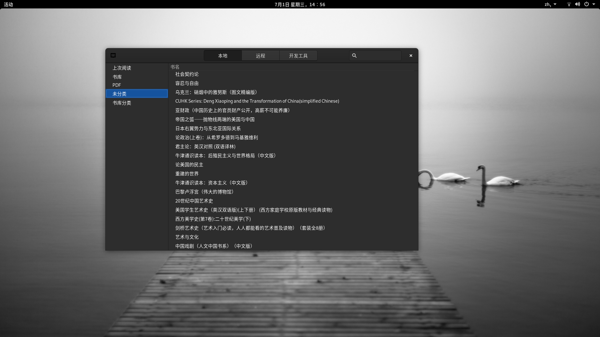
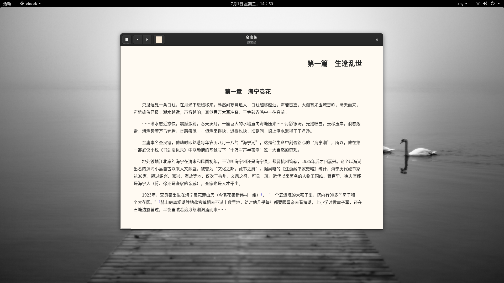
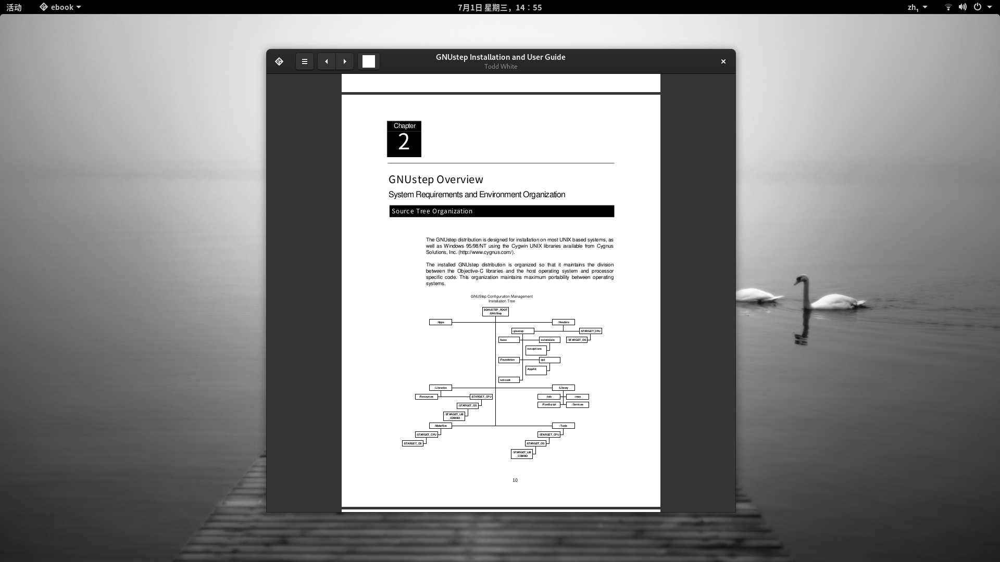

## ebook-linux

在Linux系统中的电子书浏览工具。


以下是运行界面效果


 

 

  


1、安装

```
 meson

 sudo dnf install meson gcc webkit2gtk3-devel libarchive-devel redhat-rpm-config     libsqlite3x-devel curl-devel poppler-glib-devel

 sudo dnf install 'pkgconfig(json-glib-1.0)'
 sudo dnf install 'pkgconfig(libdazzli-1.0)'
 sudo dnf install 'pkgconfig(libhandy-0.0)'
 sudo dnf install 'pkgconfig(libnotify)'
 sudo dnf install 'pkgconfig(libsecret-1)'
 sudo dnf install 'pkgconfig(libsoup-2.4)'
 sudo dnf install 'pkgconfig(webkit2gtk-4.0)'
 ```
 2、运行
 
 meson _build
 cd _build
 ninja
 ./book/bookApp


## fedora32 以上要安装以下
sudo dnf install gobject-introspection-devel

